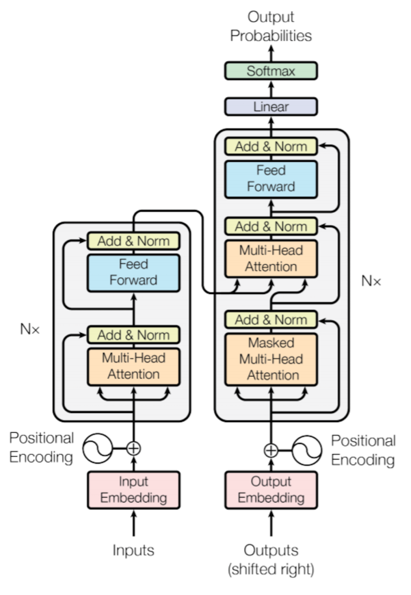

# Transformers from Scratch in PyTorch  

## The goal of this project is to deepen my understanding of PyTorch and Transformer architectures by hands-on building each component step by step in Pytorch. 

  

## Majore components/modules of the architecture?  
- Positional Encoding (Using sine/cosine and static)
- Embedding Layer  
- Multi-Head Attention  
- Feedforward Network  
- Encoder & Decoder Layers  
- Transformer Model  

This implementation focuses on clarity and correctness while following the original Transformer paper. In the future, I plan to extend this with optimizations like KV caching, Grouped Query Attention (GQA), and more efficient implementations.  

I'm open to any suggestions to enhance my learning 😊
